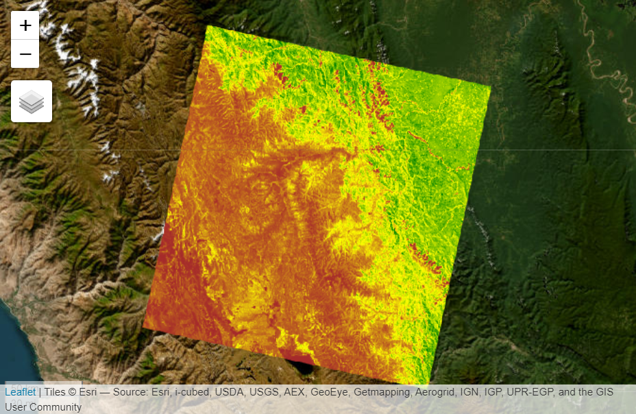

<h1 align="center">

<br>
<a href="https://r-spatial.github.io/rgee/"></a>
<a href="https://r-earthengine.com/rgeeExtra/"></a>
<a href="https://r-earthengine.com/rgeebook/"></a>
<br> rgeeExtra: An Extension for rgee <br>

</h1>

<h4 align="center">

Simplifies the interaction with GEE APIs and functions, making it more
R-like. Popular third-party GEE algorithms are made available to R users

</h4>

<p align="center">

<a href="https://colab.research.google.com/github/r-spatial/rgee/blob/examples/rgee_colab.ipynb"></a>
<a href="https://www.repostatus.org/#active"></a> <a href="https://codecov.io/gh/csaybar/rgeeExtra">

</a>
<a href="https://opensource.org/licenses/Apache-2.0"></a>
<a href="https://www.tidyverse.org/lifecycle/#maturing"></a>
<br>
<a href="https://joss.theoj.org/papers/aea42ddddd79df480a858bc1e51857fc"></a>
<a href="https://cran.r-project.org/package=rgeeExtra"></a>
<a href="https://doi.org/10.5281/zenodo.3945409"></a>
<br>
<a href="https://github.com/r-earthengine/rgeeExtra/actions/workflows/R-CMD-check.yaml"></a>

</p>

<p align="center">

• <a href="#installation">Installation</a>  •\
<a href="#how-does-it-work">How does it work?</a>  •
<a href="#example">Example</a>  •
<a href="#contributing-guide">Contributing</a>  •
<a href="#share-the-love">Citation</a>  • <a href="#credits">Credits</a>

</p>

## **Why rgeeExtra is needed?** 🤔

The 'rgeeExtra' package enhances the R user experience with Google Earth Engine (GEE) 🌍. It simplifies GEE's JavaScript-heavy API into R-friendly syntax, easing the learning curve 📉. By offering higher-level R abstractions and custom functions mirroring the JavaScript API, 'rgeeExtra' streamlines GEE's complex operations for R users, making Earth observation data analysis more accessible and efficient 🚀.

| Python                                                                                                                                     | rgee                                                                                                                                              | rgeeExtra                                                                                                                                                           |
|-----------------------|----------------|------------------------|
| \`\`\` python import ee ee.Initialize() db = 'CGIAR/SRTM90_V4' image = ee.Image(db) image.b andNames().getInfo() #\> [u'elevation'] \`\`\` | \`\`\` r library(rgee) ee_Initialize() db \<- 'CGIAR/SRTM90_V4' image \<- ee\$Image(db) image\$ba ndNames()\$getInfo() #\> [1] "elevation" \`\`\` | \`\`\` r library(rgee) library(rgeeExtra) ee_Initialize() extra_Initialize() image \<- ee\$Image\$Data set\$CGIAR_SRTM90_V4 names(image) #\> [1] "elevation" \`\`\` |

## **Installation** 🚀

You can install rgeeExtra from
[GitHub](https://github.com/r-earthengine/rgeeExtra) with:

``` r
remotes::install_github("r-earthengine/rgeeExtra")
```

## **How does it work?️**🛠

The rgeeExtra extends the following Earth Engine classes:

-   [ee\$Geometry](https://developers.google.com/earth-engine/guides/geometries) 📐
-   [ee\$Feature](https://developers.google.com/earth-engine/guides/features) 🌟
-   [ee\$FeatureCollection](https://developers.google.com/earth-engine/guides/feature_collections) 🗂️
-   [ee\$Image](https://developers.google.com/earth-engine/guides/image_overview) 🖼️
-   [ee\$ImageCollection](https://developers.google.com/earth-engine/guides/ic_creating) 📚

rgeeExtra develops and maintains new methods and constructors that
extend the most popular GEE classes (e.g., `ee$Feature$Extra\_...`). All
third-party methods implemented by rgeeExtra start with `Extra\_.` To
learn more about all the functionalities that rgeeExtra offers, please
refer to the article [Features] for additional information.

## Example

Look at this simple example to estimate the NDVI from a Landsat-8
Surface Reflectance image.

With [**rgee**](https://github.com/r-spatial/rgee):

``` r
# Load 'rgee' and initialize GEE
library(rgee)
ee_Initialize()

# Compute squared NDVI from Landsat 8 image
img <- ee$Image("LANDSAT/LC08/C02/T1_L2/LC08_007067_20140822")$
  normalizedDifference(c("SR_B5", "SR_B4"))$
  pow(2)

# Visualize squared NDVI on map
Map$centerObject(img)
Map$addLayer(
  eeObject = img, 
  visParams = list(
    min = 0, 
    max = 0.2, 
    palette = c("brown", "yellow", "green")
    ),
  name = "Squared NDVI")
```

With [**rgeeExtra**](https://github.com/r-earthengine/rgeeExtra):

``` r
# Load 'rgee' and initialize GEE
library(rgee)
library(rgeeExtra)

ee_Initialize()
extra_Initialize()

# Compute squared NDVI from Landsat 8 image
img <- ee$Image("LANDSAT/LC08/C02/T1_L2/LC08_007067_20140822")
ndvi <- ((img[["SR_B5"]] - img[["SR_B4"]]) / (img[["SR_B5"]] + img[["SR_B4"]])) ** 2
names(ndvi) <- "Squared NDVI"

# Visualize squared NDVI on map
Map$centerObject(ndvi)
Map$addLayer(
  eeObject = ndvi, 
  visParams = list(
    min = 0, 
    max = 0.2, 
    palette = c("brown", "yellow", "green")
    ),
  name = "Squared NDVI"
  )
```

<p align="center">
  
</p>


## Code of Conduct

Please note that the `rgeeExtra` project is released with a [Contributor
Code of Conduct](CODE_OF_CONDUCT.md). By contributing to this project,
you agree to abide by its terms.

## Contributing Guide

👍 Thanks for taking the time to contribute! 🎉👍 Please review our
[Contributing Guide](CONTRIBUTING.md).

## Share the love

Think **rgeeExtra** is useful? Let others discover it, by telling them
in person via Twitter or a blog post.

Using **rgeeExtra** for a paper you are writing? Consider citing it

``` r
citation("rgeeExtra")
To cite rgee in publications use:
  
  C Aybar, Q Wu, L Bautista, R Yali and A Barja (2020) rgee: An R
  package for interacting with Google Earth Engine Journal of Open
  Source Software URL https://github.com/r-spatial/rgee/.

A BibTeX entry for LaTeX users is

@Article{,
  title = {rgee: An R package for interacting with Google Earth Engine},
  author = {Cesar Aybar and Quisheng Wu and Lesly Bautista and Roy Yali and Antony Barja},
  journal = {Journal of Open Source Software},
  year = {2020},
}
```

## Credits

We would like to mention the following third-party R/Python packages for
contributing indirectly to the improvement of rgeeExtra:

-   [**eemont - David Montero
    Loaiza**](https://github.com/davemlz/eemont)
