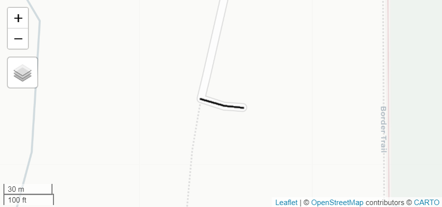

```{r, include = FALSE}
knitr::opts_chunk$set(
  collapse = TRUE,
  comment = "#>",
  eval = FALSE
)
```

`rgeeExtra` serves as a wrapper for the Python package named `eeExtra`. The creation of `eeExtra` was driven by a need to consolidate various third-party GEE Javascript and Python packages and projects found on GitHub in the same programming language and style, avoiding dependencies. `rgeeExtra` ensures a seamless integration of `eeExtra` within the R ecosystem

```{r setup}
library(rgeeExtra)
library(rgee)

ee_Initialize()        # Initialize the Google Earth Engine API connection
extra_Initialize()     # Load the extended functionalities of rgeeExtra
```

## **Features for `ee$FeatureCollection`**

`ee$FeatureCollection` objects represent geographic features which are fundamental to spatial analyses. Enhanced manipulation of these objects in R can significantly streamline workflows.

### **1. Subsetting**

The `[[` method enables extraction or modification of specific elements within an `ee$FeatureCollection` by index. This function is essential for segmenting and managing subsets of features in Earth Engine for targeted geographic analysis.

```{r}
# Load and select the first two features from 'TIGER/2016/Roads' collection.
fc_tiger <- ee$FeatureCollection('TIGER/2016/Roads')
fc_tiger_subset <- fc_tiger[[1:2]]

# Center and display the selected features on the map.
Map$centerObject(fc_tiger_subset)
Map$addLayer(fc_tiger_subset)
```
<center></center>

### **2. Names**

The `names` function for `ee$FeatureCollection` retrieves the names of properties, providing a clear overview of attributes within Earth Engine's feature collections for effective data management and analysis.

```{r}
# Load the 'WRI/GPPD/power_plants' Feature Collection from Earth Engine.
fc <- ee$FeatureCollection('WRI/GPPD/power_plants')

# List the methods and properties available for the feature collection.
methodsProperties <- names(fc)
# Output includes methods like "aggregate_array", "filter", "map", and properties like "args", "name".
```
