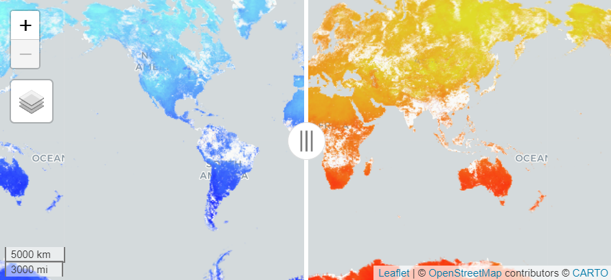
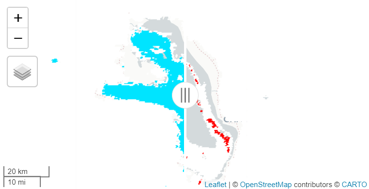
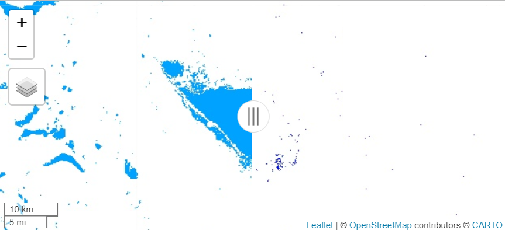
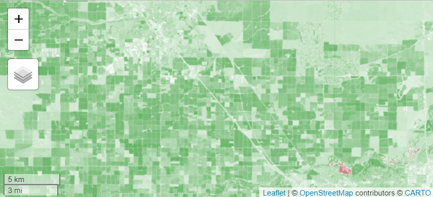
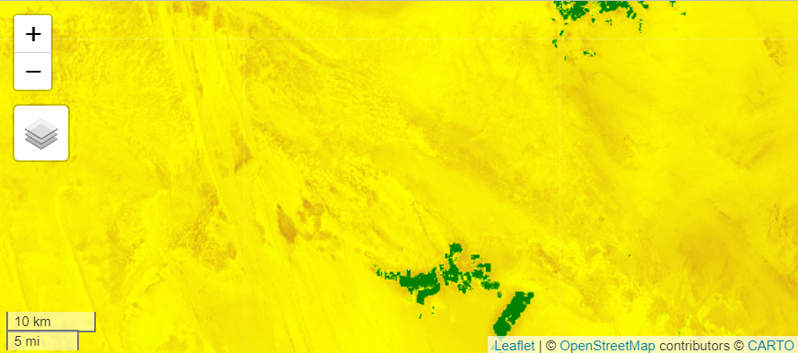
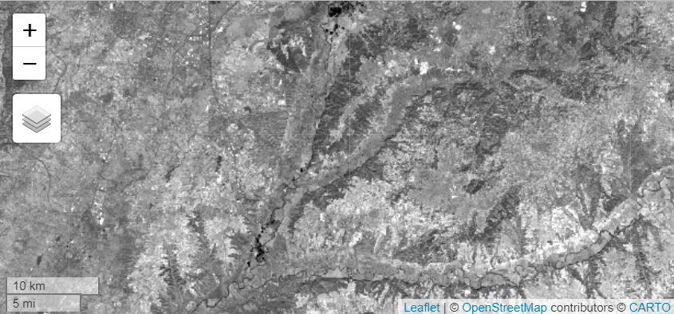
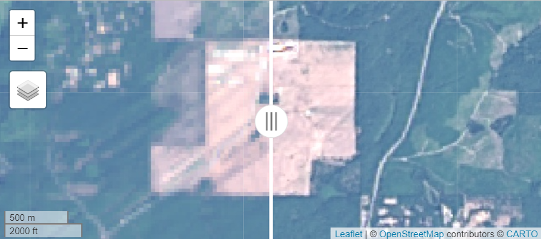
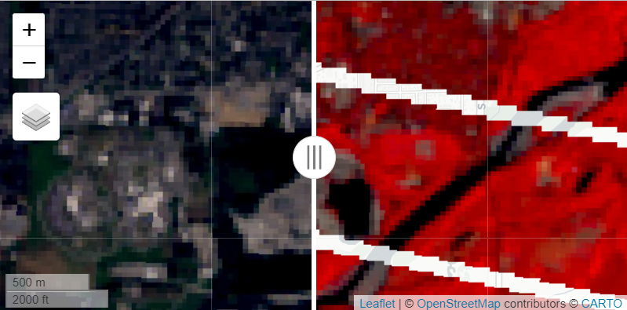
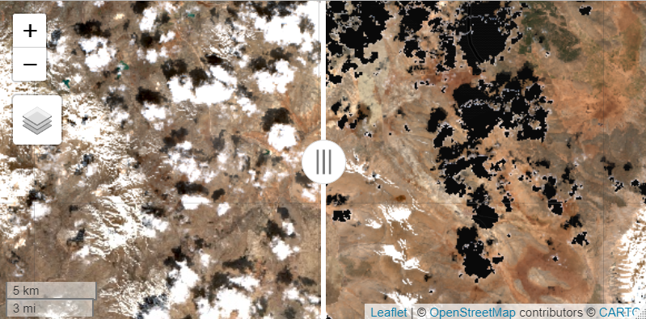
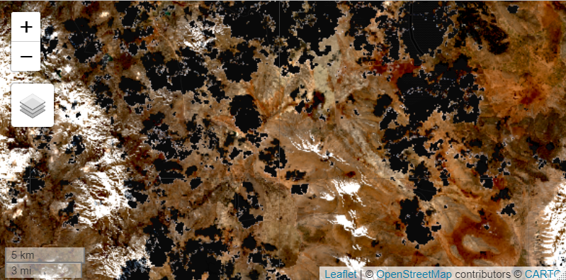

```{r, include = FALSE}
knitr::opts_chunk$set(
  collapse = TRUE,
  comment = "#>",
  eval = FALSE
)
```

`rgeeExtra` serves as a wrapper for the Python package named `eeExtra`. The creation of `eeExtra` was driven by a need to consolidate various third-party GEE Javascript and Python packages and projects found on GitHub in the same programming language and style, avoiding dependencies. `rgeeExtra` ensures a seamless integration of `eeExtra` within the R ecosystem

```{r setup}
library(rgeeExtra)
library(rgee)

ee_Initialize()        # Initialize the Google Earth Engine API connection
extra_Initialize()     # Load the extended functionalities of rgeeExtra
```

## **Features for `ee$Image`**

`ee$Image` objects encapsulate individual satellite images and provide a suite of methods for image manipulation and analysis in Earth Engine. The `rgeeExtra` package extends these capabilities within R, offering tools for both simple and advanced image processing tasks.

### **1. Earth Engine arithmetic, logic and compare generic functions**

Arithmetic and logical operations are key for advanced raster data analysis, enabling intricate band math and conditional algorithms. These tools facilitate the merging of band information, implementation of corrections, and execution of classification and change detection algorithms.

#### **Arithmetic Operations**

Utilize arithmetic operators like `+`, `-`, `*`, `/`, and `^` on `ee$Image` objects for complex image-based calculations and analyses in Earth Engine.

```{r}
# Load and process MODIS land surface temperature images for two dates.
temp1 <- ee$ImageCollection("MODIS/006/MOD11A1")$
  filterDate("2020-01-01", "2020-01-08")$
  mean()$
  select("LST_Day_1km") * 0.02 # Scale factor applied to convert to Kelvin.

temp2 <- ee$ImageCollection("MODIS/006/MOD11A1")$
  filterDate("2020-07-01", "2020-07-08")$
  mean()$
  select("LST_Day_1km") * 0.02  # Scale factor applied to convert to Kelvin.

# Calculate temperature difference and ratio
temp_diff <- temp1 - temp2
temp_ratio <- temp1 / temp2

# Visualize temperature difference and ratio on map.
m1 <- Map$addLayer(
  eeObject = temp_diff,
  visParams = list(min = -65, max = 63, palette = c("#8EFFF6", "#0400FF")),
  name = "Difference (K)"
)

m2 <- Map$addLayer(
  eeObject = temp_ratio, 
  visParams = list(min = 0.8, max = 1.2, palette = c("#E0DB29", "#FE130C")),
  name = "Ratio"
)

m1 | m2
```
<center></center>

#### **Logical Operations**

Apply logical operators such as `!`, `&`, and `|` to `ee$Image` objects, enabling advanced logical manipulation and condition-based filtering in Earth Engine.

```{r}
# Load snow index images from MODIS for two different dates.
snow_index1 <- ee$ImageCollection("MODIS/006/MOD10A1")$
  filterDate("2020-01-01", "2020-01-08")$
  mean()$
  select("NDSI_Snow_Cover")
snow_index2 <- ee$ImageCollection("MODIS/006/MOD10A1")$
  filterDate("2020-07-01", "2020-07-08")$
  mean()$
  select("NDSI_Snow_Cover")

# Identify snow coverage and changes between dates using logic operators.
snow_present <- snow_index1 > 40  # NDSI > 40 indicates snow
snow_change <- !(snow_present) & (snow_index2 > 40)  # Detect change in snow coverage

# Set map center and add layers to visualize snow presence and change.
Map$setCenter(lon = -67.05, lat = -18.81, zoom = 9)
m1 <- Map$addLayer(
  eeObject = snow_present, 
  visParams = list(palette = c("#FFFFFF", "#00E4FF")),
  name = "Snow"
)
m2 <- Map$addLayer(
  eeObject = snow_change, 
  visParams = list(palette = c("#FFFFFF", "#FF0000")),
  name = "Snow Change"
)

m1 | m2
```
<center></center>

#### **Comparison Operations**

Employ comparison operators including `==`, `!=`, `>`, `<`, `<=`, `>=` for `ee$Image` objects to facilitate detailed comparative analysis and decision-making in Earth Engine.

```{r}
# Load water index data from JRC's Monthly History for two periods.
water_index_pre <- ee$ImageCollection("JRC/GSW1_4/MonthlyHistory")$
  filterDate("2020-01-01", "2020-01-08")$
  mean()$
  select("water")
water_index_post <- ee$ImageCollection("JRC/GSW1_4/MonthlyHistory")$
  filterDate("2020-07-01", "2020-07-08")$
  mean()$
  select("water")

# Identify stable water areas and areas with water increase.
water_post <- water_index_post == 2  # Areas with water post-period
water_pre <- water_index_pre == 2  # Areas with water pre-period
stable_water <- water_post & water_pre  # Areas with stable water presence
water_increase <- water_index_post < water_index_pre  # Areas with water increase 

# Center map and visualize stable water areas and water increase.
Map$setCenter(lon = -76.09, lat = -11.02, zoom = 10)
m1 <- Map$addLayer(
  eeObject = stable_water, 
  visParams = list(palette = c("#FFFFFF", "#00A2FF")),
  name = "Water stable"
)
m2 <- Map$addLayer(
  eeObject = water_increase, 
  visParams = list(palette = c("#FFFFFF", "#000CFF")),
  name = "Water increase"
)

m1 | m2
```
<center></center>

### **2. Mathematical functions**

In Earth Engine, `ee$Image` objects offer a vast array of mathematical functions, such as `abs`, `sqrt`, `log`, and trigonometric operations like `sin` and `cos`. These functions enable detailed pixel-level manipulation, enhancing image analysis capabilities for a variety of applications, from environmental monitoring to geographical research. Such manipulations can reveal intricate details and patterns in satellite imagery, crucial for advanced remote sensing analysis.

```{r}
# Define the Area of Interest (AOI) - Central Valley, California.
aoi <- ee$Geometry$Rectangle(c(-121.0, 36.8, -119.0, 37.0))

# Load NDVI image from Landsat and clip it to the AOI.
ndvi_img <- ee$ImageCollection("LANDSAT/LC08/C01/T1_8DAY_NDVI")$
  filterDate("2020-06-01", "2020-06-08")$
  mean()$
  select("NDVI")$
  clip(aoi)

# Apply mathematical transformations to the clipped NDVI image.
abs_ndvi <- abs(ndvi_img)                # Absolute value of NDVI.
sqrt_ndvi <- sqrt(ndvi_img)              # Square root of NDVI.
ceiling_ndvi <- ceiling(ndvi_img)        # Ceiling of NDVI.
log_ndvi <- log(ndvi_img)                # Natural logarithm of NDVI.
exp_ndvi <- exp(ndvi_img)                # Exponential function of NDVI.
log_transformed_ndvi <- log1p(ndvi_img)  # Log(1 + NDVI).

# Visualize the transformations applied to NDVI.
visParams <- list(min = -1, max = 1, palette = c("brown", "white", "green"))
Map$centerObject(aoi, zoom = 11)
Map$addLayer(abs_ndvi, visParams, "Absolute NDVI") +
  Map$addLayer(sqrt_ndvi, visParams, "Square Root NDVI") +
  Map$addLayer(ceiling_ndvi, visParams, "Ceiling NDVI") +
  Map$addLayer(log_ndvi, visParams, "Log NDVI") +
  Map$addLayer(exp_ndvi, visParams, "Exp NDVI") +
  Map$addLayer(log_transformed_ndvi, visParams, "Log Transformed NDVI")
```
<center></center>

### **3. Spectral Indices**

In Earth Engine, the `ee$Image$Extra_spectralIndex` function is essential for computing a wide range of spectral indices on `ee$Image` objects. This versatile tool allows for the calculation of indices like NDVI, EVI, and SAVI, each customizable with specific parameters, facilitating detailed environmental analysis and enhancing the understanding of vegetation health, water bodies, urban areas, and other key earth surface features.

```{r}
# Load first COPERNICUS/S2_SR image, compute NDVI and SAVI
s2_indices <- ee$ImageCollection("COPERNICUS/S2_SR")[[1]] %>%
  ee$Image$Extra_preprocess() %>%
  ee$Image$Extra_spectralIndex(c("NDVI", "SAVI"))

# Set visualization parameters
visParams <- list(
  min = 0, 
  max = 0.2, 
  palette = c("brown", "yellow", "green")
)

# Display NDVI on map with custom visuals
Map$centerObject(s2_indices, zoom = 10)
Map$addLayer(
  eeObject = s2_indices[["NDVI"]], 
  visParams = visParams,
  name = "NDVI"
)
```
<center></center>

### **4. Tasseled Cap Transformation**

The `ee$Image$Extra_tasseledCap` function in Earth Engine provides a powerful tool for transforming `ee$Image` objects, calculating tasseled cap components such as brightness, greenness, and wetness. This transformation, applied using specific coefficients for platforms like Sentinel-2 and Landsat, enriches the analysis of land cover and environmental characteristics by enhancing spectral band information.

```{r}
# Apply Tasseled Cap transformation to a Sentinel-2 image
tc <- ee$Image("COPERNICUS/S2/20190310T105851_20190310T110327_T30TVK") %>%
  ee$Image$Extra_tasseledCap()

# Display the names of the transformed bands
names(tc)
# Output: "B1", "B2", "B3", ..., "B12", "TCB", "TCG", "TCW"

# Map display with Tasseled Cap Brightness, Greenness, and Wetness layers
Map$centerObject(tc, zoom = 10)
Map$addLayer(tc$select("TCG"), list(min = -4700, max = 3900), "TC Greenness") +
  Map$addLayer(tc$select("TCW"), list(min = -23700, max = 350), "TC Wetness") +
  Map$addLayer(tc$select("TCB"), list(min = 950, max = 11000), "TC Brightness")
```
<center></center>

### **5. Panchromatic Sharpening**

The `ee$Image$Extra_panSharpen` function in Earth Engine is a sophisticated tool for enhancing `ee$Image` objects through panchromatic sharpening. This technique improves image resolution, offering algorithms like SFIM and HPFA, and includes the option to assess quality, such as spectral distortion, enhancing the clarity and detail of satellite imagery.

```{r}
# Load Landsat 8 TOA reflectance image from GEE
img <- ee$Image("LANDSAT/LC09/C02/T1_TOA/LC09_047027_20230815")

# Apply HPFA panchromatic sharpening to enhance sharpness
img_sharp <- ee$Image$Extra_panSharpen(
  img, 
  method="HPFA", 
  qa=c("MSE", "RMSE"), 
  maxPixels=1e13
)

# Define visualization parameters for displaying the images
visParams <- list(
  bands = c("B4","B3","B2"),
  min = 0, 
  max = 0.15, 
  gamma = 1.4
)

# Display original and HPFA-sharpened images on the map
Map$setCenter(lon = -123.11, lat = 47.307, zoom = 14)
Map$addLayer(img, visParams, "Original Image") |
  Map$addLayer(img_sharp, visParams, "Sharpened Image")
```
<center></center>


### **6. Histogram Matching**

The `ee$Image$Extra_matchHistogram` function in Earth Engine enables precise histogram matching of an `ee$Image` to a target image. This function adjusts the distribution of pixel values in specified bands to mirror those in the target, enhancing comparability between images for consistent analysis, especially useful in time-series or multi-sensor studies.

```{r}
# Load Landsat 8 and 7 images for histogram matching.
source <- ee$Image("LANDSAT/LC08/C02/T1_TOA/LC08_047027_20160819")
target <- ee$Image("LANDSAT/LE07/C02/T1_TOA/LE07_046027_20150701")

# Map Landsat 8 bands to corresponding Landsat 7 bands.
bands <- list("B4"="B3", "B3"="B2", "B2"="B1")

# Apply histogram matching from source to target using the band mapping.
matched <- ee$Image$Extra_matchHistogram(source, target, bands)

# Visualization settings for the images.
visParams <- list(
  bands = c("B4","B3","B2"),
  min = 0.1, 
  max = 0.5, 
  gamma = 1.5
)

# Display matched and target images on the map for comparison.
Map$setCenter(lon = -121.984, lat = 47.847, zoom = 14)
m1 <- Map$addLayer(matched, visParams = visParams, "matched") 
m2 <- Map$addLayer(target, visParams = visParams, "target")

m1 | m2
```
<center></center>

### **7. Cloud Masking**

Cloud masking with `ee$Image$Extra_maskClouds` in Earth Engine is a critical preprocessing step, essential for reducing cloud and shadow interference in remote sensing imagery. This function tailors cloud masking through adjustable parameters like cloud probability, buffer distance, and the CDI threshold, crucial for distinguishing clouds from bright surfaces and even masking water bodies under specific conditions.

```{r}
# Cloud mask a Sentinel-2 image: 75% cloud prob, 300m buffer, -0.5 CDI
img <- ee$Image("COPERNICUS/S2_SR/20170328T083601_20170328T084228_T35SQA") 
img_mask <- ee$Image$Extra_maskClouds(img, prob = 75, buffer = 300, cdi = -0.5)

# Get band names after masking
names(img_mask)
# Output: "B1", "B2", "B3", ..., "CLOUD_MASK", "CLOUD_MASK_CDI", "SHADOW_MASK", "CLOUD_SHADOW_MASK"

# Apply cloud and shadow masking with specified thresholds.
visParams <- list(
  bands = c("B4","B3","B2"),
  min = 200, 
  max = 4600, 
  gamma = 1.5
)

# Display both original and masked images on the map for comparison.
Map$setCenter(lon = 30.061, lat = 36.9, zoom = 11)
m1 <- Map$addLayer(img, visParams = visParams, name = "Image") 
m2 <- Map$addLayer(img_mask, visParams = visParams, name = "Mask image")

m1 | m2
```
<center></center>


### **8. Automated Preprocessing**

The `ee$Image$Extra_preprocess` function streamlines preprocessing for `ee$Image` objects, encompassing essential tasks like cloud masking and decompression. It adeptly removes cloud and shadow pixels and converts integer pixel values to floating-point, enhancing the clarity and usability of Earth Engine imagery for diverse analyses.

```{r}
# Load a Sentinel-2 image and apply automated preprocessing.
img <- ee$Image("COPERNICUS/S2_SR/20170328T083601_20170328T084228_T35SQA") %>%
  ee$Image$Extra_preprocess()

# Visualization parameters: RGB bands, adjusted min, max, and gamma values.
visParams <- list(
  bands = c("B4","B3","B2"),
  min = 0.1, 
  max = 0.5, 
  gamma = 1.5
)

# Display the preprocessed image on the map.
Map$setCenter(lon = 30.061, lat = 36.9, zoom = 11)
Map$addLayer(img, visParams = visParams, "Preprocessed image")
```
<center></center>


### **9. Summary Methods**

Summary methods extract key statistical data from images, which is critical for monitoring environmental changes and analyzing spatial patterns.

```{r}
# Load a Sentinel-2 surface reflectance image from Earth Engine
img_demo <- ee$Image("COPERNICUS/S2_SR/20190310T105851_20190310T110327_T30TVK")

mean_img <- mean(img_demo)   # Compute mean of image bands
min_img <- min(img_demo)     # Compute minimum of image bands
max_img <- max(img_demo)     # Compute maximum of image bands
```

### **10. Minimum and maximum values**

The `ee$Image$Extra_maxValue` and `ee$Image$Extra_minValue` functions in Earth Engine provide a method to determine the maximum and minimum values within an `ee$Image`. These functions offer two modes: "Rectangle" for using the image's footprint and "Points" for sampling over it. They are particularly useful for approximating extreme values in large datasets.

```{r}
# Load the first image's "B1" band from LANDSAT_LC08_C02_T1_TOA dataset
image <- ee$ImageCollection$Dataset$LANDSAT_LC08_C02_T1_TOA[[1]][["B1"]]

# Compute minimum value of "B1" band
min_value <- ee$Image$Extra_minValue(image)
min_value
# Result: [1] 0.1450491

# Compute maximum value of "B1" band
max_value <- ee$Image$Extra_maxValue(image)
max_value
# Result: [1] 1.08361
```

### **11. Retrieve offset parameter**

Earth Engine utilizes a lossless compression technique where `IMG_Float_Values = scale * IMG_Integer_Values + offset`. The `ee$Image$Extra_getOffsetParams()` function retrieves the offset for each band of an `ee$Image`, critical for reverting scaled integers to their original float values, ensuring data precision and sensor-specific calibration.

```{r}
# Retrieve offset parameters from the first image in NASA IMERG V06 collection
offset_params <- ee$ImageCollection("NASA/GPM_L3/IMERG_V06")[[1]] %>%
  ee$Image$Extra_getOffsetParams()
offset_params
# Result:
# $HQobservationTime [1] 0
# $HQprecipSource [1] 0
# $HQprecipitation [1] 0
# $IRkalmanFilterWeight [1] 0
# $IRprecipitation [1] 0
# $precipitationCal [1] 0
# $precipitationUncal [1] 0
# $probabilityLiquidPrecipitation [1] 0
# $randomError [1] 0
```

### **12. Retrieve scale parameter**

Earth Engine uses a lossless compression method: `IMG_Float_Values = scale * IMG_Integer_Values + offset`. The `ee$Image$Extra_getScaleParams()` function extracts the scale for each band of an `ee$Image`, pivotal for translating integer data to accurate float values, maintaining data integrity and sensor-specific fidelity.

```{r}
# Retrieve scale parameters from the first image in NASA IMERG V06 collection
scale_params <- ee$ImageCollection("NASA/GPM_L3/IMERG_V06")[[1]] %>%
  ee$Image$Extra_getScaleParams()
scale_params
# Result:
# $HQobservationTime [1] 1
# $HQprecipSource [1] 1
# $HQprecipitation [1] 1
# $IRkalmanFilterWeight [1] 1
# $IRprecipitation [1] 1
# $precipitationCal [1] 1
# $precipitationUncal [1] 1
# $probabilityLiquidPrecipitation [1] 1
# $randomError [1] 1
```

### **13. Automatic decompression**

Earth Engine applies a straightforward lossless compression method: Floating-point image values (IMG_Float_Values) are calculated from integer image values (IMG_Integer_Values) using the formula `IMG_Float_Values = scale * IMG_Integer_Values + offset`. The `ee$Image$Extra_scaleAndOffset` method is used to convert integer pixel values back to floating-point numbers.

```{r}
# Adjust first image in NASA IMERG V06 for scale and offset.
adjusted_image <- ee$ImageCollection("NASA/GPM_L3/IMERG_V06")[[1]] %>%
  ee$Image$Extra_scaleAndOffset()
```

### **14. Retrieve STAC metadata**

STAC (SpatioTemporal Asset Catalog) metadata plays a crucial role in Earth Engine by standardizing the discovery and utilization of spatial-temporal assets. It simplifies access to data, making it more efficient and user-friendly. The function `ee$Image$Extra_getSTAC()` is designed to retrieve this metadata for an `ee$Image`, enhancing data management and interoperability.

```{r}
# Retrieve STAC metadata for the first image in NASA's GPM L3 IMERG V06 collection
stac_metadata <- ee$ImageCollection("NASA/GPM_L3/IMERG_V06")[[1]] %>%
  ee$Image$Extra_getSTAC()

# Description of the dataset
stac_metadata$description

# Spatial extent of the dataset
stac_metadata$extent$spatial$bbox

# Temporal interval of the dataset
stac_metadata$extent$temporal$interval

# Data Provider IDs
stac_metadata$`gee:provider_ids`

# Terms of use of the dataset
stac_metadata$`gee:terms_of_use`

# Type of the collection
stac_metadata$`gee:type`

# Dataset ID
stac_metadata$id

# Keywords associated with the dataset
stac_metadata$keywords

# License information
stac_metadata$license

# Links to additional resources and information
stac_metadata$links

# Providers of the dataset
stac_metadata$providers

# Citation information
stac_metadata$`sci:citation`

# Digital Object Identifier (DOI)
stac_metadata$`sci:doi`

# STAC version and extensions
stac_metadata$stac_version
stac_metadata$stac_extensions

# Summaries of band information and visualizations
stac_metadata$summaries$`eo:bands`
stac_metadata$summaries$`gee:visualizations`

# Citation information
stac_metadata$`sci:citation`

# Digital Object Identifier (DOI)
stac_metadata$`sci:doi`

# STAC version and extensions
stac_metadata$stac_version
stac_metadata$stac_extensions

# Summaries of band information and visualizations
stac_metadata$summaries$`eo:bands`
stac_metadata$summaries$`gee:visualizations`
```

### **15. Subsetting Bands**

Utilize the `[[` operator in R to selectively access or modify specific bands within an `ee$Image`. This feature is essential for focusing on particular spectral bands, simplifying the process of analyzing and processing multispectral satellite imagery.

```{r}
# Extract specific bands from a Sentinel-2 image and display their names
image <- ee$Image("COPERNICUS/S2_SR/20190310T105851_20190310T110327_T30TVK")[[c(2, 4, 6, 8)]]
names(image)  # Result: "B2", "B4", "B6", "B8"
```

### **16. Length of an Image**

The `length` function counts the number of bands in an `ee$Image` object, offering a straightforward way to assess the complexity of Earth Engine Images.

```{r}
# Count bands in the first Sentinel-2 image
image <- ee$ImageCollection("COPERNICUS/S2_SR")[[1]]
length(image)  # Returns 23, the number of bands.
```

### **17. Setting Image Length**

Adjusting the `length` of an image object is a useful technique in managing image collections, such as for constructing time series or subsets of data.

```{r}
# Retrieve the first Sentinel-2 image and display its number of bands
image <- ee$ImageCollection("COPERNICUS/S2_SR")[[1]]

length(image)  # Returns the number of bands in the image: 23
# Display band names of the image
names(image)  # Shows band names: "B1", "B2", "B3", ..., "QA60"

length(image) <- 10 # Change length of image object to 10
# Display updated band names (first 10 bands)
names(image)  # Shows the first 10 bands: "B1", "B2", ..., "B9"
```

### **18. Names of Images layers (bands)**

The `names` function retrieves band names from an `ee$Image` object, providing a simple method to identify and reference specific layers within Earth Engine Images.

```{r}
# Load the first three bands of a specific Sentinel-2 image
img_demo <- ee$Image("COPERNICUS/S2_SR/20190310T105851_20190310T110327_T30TVK")[[1:3]]

# Retrieve and display the names of these bands
names(img_demo)  # Returns the names of the selected bands: "B1", "B2", "B3"
```

### **19. Rename of Images layers (bands)**

Renaming bands in an `ee$Image` object using the `names` function in Earth Engine enhances clarity and organization, aligning each band with elements of a character vector.

```{r}
# Load the first three bands of a specific Sentinel-2 image
image <- ee$Image("COPERNICUS/S2_SR/20190310T105851_20190310T110327_T30TVK")[[1:3]]

# Display the original names of these bands
names(image)  # Original band names: "B1", "B2", "B3"

# Rename the bands for clarity
names(image) <- c("B01", "B02", "B03")

# Display the updated band names
names(image)  # Updated band names: "B01", "B02", "B03"
```

### **20. Citation in publications**

Citations play a key role in recognizing data sources, particularly for images used in research and publications. They ensure the traceability and credibility of the analysis.

```{r}
# Retrieve citation for the first image in NASA's IMERG V06 collection
citation <- ee$ImageCollection("NASA/GPM_L3/IMERG_V06")[[1]] %>% 
  ee$Image$Extra_getCitation()

# Display the citation
citation

# Citation: "Huffman, G.J., E.F. Stocker, D.T. Bolvin, E.J. Nelkin, Jackson Tan (2019),
# GPM IMERG Final Precipitation L3 Half Hourly 0.1 degree x 0.1 degree V06,
# Greenbelt, MD, Goddard Earth Sciences Data and Information Services Center (GES DISC),
# Accessed: [Data Access Date],
# [doi:10.5067/GPM/IMERG/3B-HH/06](https://doi.org/10.5067/GPM/IMERG/3B-HH/06)"
```

### **21. Get the Digital Object Identifier (DOI)**

Retrieving the DOI of datasets in Earth Engine is vital for data sharing and reproducibility in scientific research, providing a permanent link to the datasets.

```{r}
# Fetch DOI for first image in NASA IMERG V06 collection
doi <- ee$ImageCollection("NASA/GPM_L3/IMERG_V06")[[1]] %>% 
  ee$Image$Extra_getDOI()

doi  # "10.5067/GPM/IMERG/3B-HH-L/06"
```

