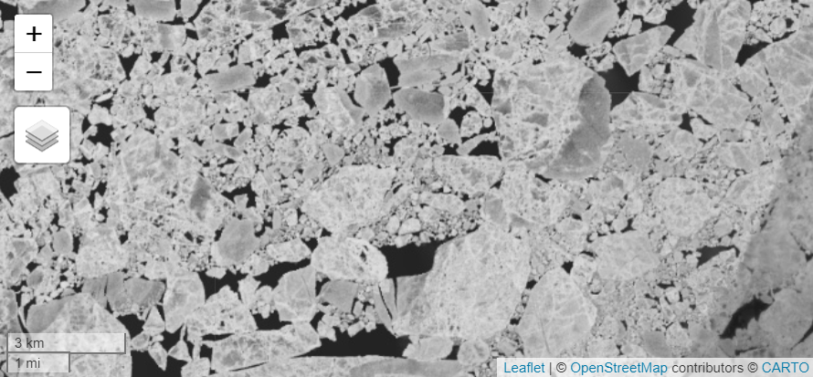
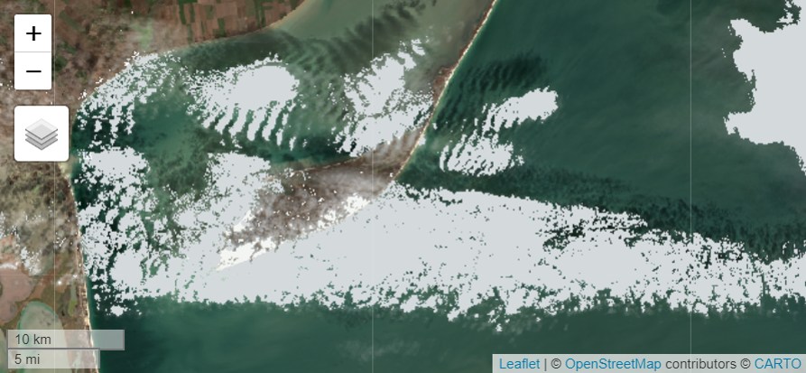
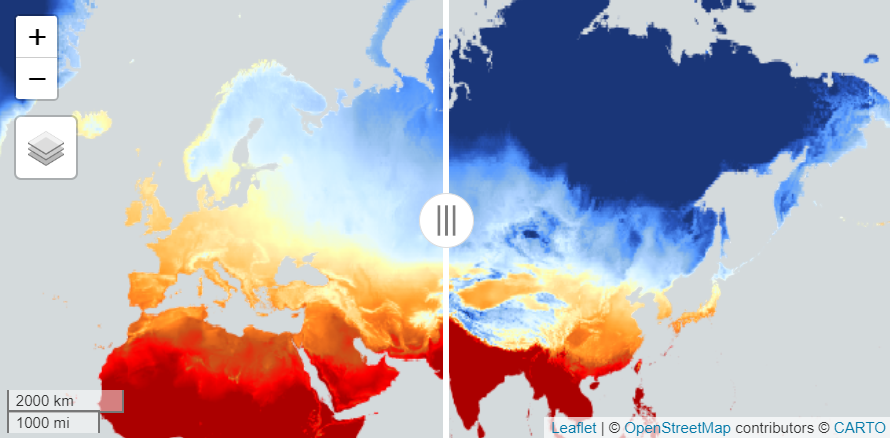
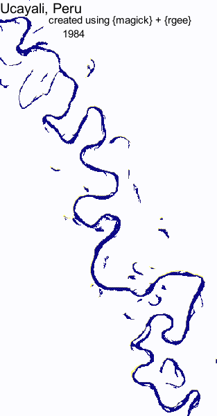
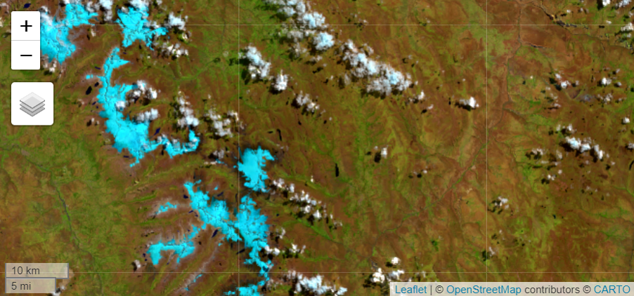

```{r, include = FALSE}
knitr::opts_chunk$set(
  collapse = TRUE,
  comment = "#>",
  eval = FALSE
)
```

`rgeeExtra` serves as a wrapper for the Python package named `eeExtra`. The creation of `eeExtra` was driven by a need to consolidate various third-party GEE Javascript and Python packages and projects found on GitHub in the same programming language and style, avoiding dependencies. `rgeeExtra` ensures a seamless integration of `eeExtra` within the R ecosystem

```{r setup}
library(rgeeExtra)
library(rgee)

ee_Initialize()        # Initialize the Google Earth Engine API connection
extra_Initialize()     # Load the extended functionalities of rgeeExtra
```

## **Features for `ee$ImageCollection`**

`ee$ImageCollection` objects in Earth Engine represent collections of satellite images, allowing for comprehensive analysis over time and space. The `rgeeExtra` package enhances these functionalities within R, providing tools for diverse and complex image collection processing and analysis.

### **1. Spectral Indices**

The `ee$ImageCollection$Extra_spectralIndex` function efficiently computes spectral indices for `ee$ImageCollection` objects, offering a broad range of indices for diverse environmental analyses. This tool enables tailored index computation, catering to specific requirements in vegetation, water, urban, and other thematic studies.

```{r}
# Load Sentinel-2 SR image collection and compute NDVI and SAVI indices
s2_indices <- ee$ImageCollection("COPERNICUS/S2_SR") %>%
  ee$ImageCollection$Extra_spectralIndex(c("NDVI", "SAVI"))

# Set visualization parameters for NDVI
visParams <- list(
  min = 0, 
  max = 0.2, 
  palette = c("brown", "yellow", "green")
)

# Select the first image for display on the map
s2_indice <- s2_indices[[1]]

# Display NDVI of the first image with custom visualization settings
Map$centerObject(s2_indice, zoom = 10)
Map$addLayer(
  eeObject = s2_indice[["NDVI"]], 
  visParams = visParams,
  name = "NDVI"
)
```
<center></center>

### **2. Tasseled Cap Transformation**

The `ee$ImageCollection$Extra_tasseledCap` function applies Tasseled Cap transformations to Earth Engine ImageCollections. It supports various satellite platforms, calculating key components like brightness, wetness, and greenness, crucial for advanced land cover and vegetation analysis across diverse datasets like Sentinel-2, Landsat, and MODIS.

```{r}
# Tasseled Cap transformation on LANDSAT LC09 C02 T1 L2 collection.
ic <- ee$ImageCollection("LANDSAT/LC09/C02/T1_L2") %>% 
  ee$ImageCollection$Extra_tasseledCap()

# Select the first transformed image.
image <- ic[[1]]

# Map display: Brightness, Greenness, and Wetness layers.
Map$centerObject(image)
Map$addLayer(image$select("TCB"), list(min = 1900, max = 76400), "TC Brightness") +
  Map$addLayer(image$select("TCG"), list(min = -23500, max = 1660), "TC Greenness") +
  Map$addLayer(image$select("TCW"), list(min = -14200, max = 29800), "TC Wetness")
```
<center></center>

### **3. Panchromatic Sharpening**

Enhance spatial resolution in `ee$ImageCollection` objects using the `ee$ImageCollection$Extra_panSharpen` function. This tool offers various sharpening methods like SFIM and HPFA, along with optional quality assessments, to improve image clarity and detail for more precise analysis.

```{r}
# Load Landsat 8 TOA reflectance image from GEE
img <- ee$Image("LANDSAT/LC09/C02/T1_TOA/LC09_047027_20230815")

# Apply HPFA panchromatic sharpening to enhance sharpness
img_sharp <- ee$Image$Extra_panSharpen(
  img, 
  method="HPFA", 
  qa=c("MSE", "RMSE"), 
  maxPixels=1e13
)

# Define visualization parameters for displaying the images
visParams <- list(
  bands = c("B4","B3","B2"),
  min = 0, 
  max = 0.15, 
  gamma = 1.4
)

# Display original and HPFA-sharpened images on the map
Map$setCenter(lon = -123.11, lat = 47.307, zoom = 14)
Map$addLayer(img, visParams, "Original Image") |
  Map$addLayer(img_sharp, visParams, "Sharpened Image")
```
<center></center>

### **4. Automated Preprocessing**

The `ee$ImageCollection$Extra_preprocess` function streamlines preprocessing of Earth Engine ImageCollections. It efficiently performs tasks like cloud masking and pixel value decompression, converting integer pixels to float point numbers, essential for accurate and clear image analysis.

```{r}
# Load and preprocess Sentinel-2 SR image collection.
ic <- ee$ImageCollection$Dataset$COPERNICUS_S2_SR %>%
  ee$ImageCollection$Extra_preprocess()

# Define visualization parameters for RGB bands.
visParams <- list(
  bands = c("B4","B3","B2"),
  min = 0, 
  max = 0.4, 
  gamma = 1.5
)

# Display 100th image from preprocessed collection on map.
Map$setCenter(lon = 35.19, lat = 46.14, zoom = 10)
Map$addLayer(ic[[100]], visParams = visParams, "Preprocessed image")
```
<center></center>

### **5. Retrieve offset parameter**

The `ee$ImageCollection$Extra_getOffsetParams` function is essential for accessing offset parameters in `ee$ImageCollection` objects, crucial for understanding Earth Engine's lossless compression, encapsulated in the equation `IMG_Float_Values = scale * IMG_Integer_Values + offset`. This aids in precise data conversion and analysis.

```{r}
# Get offset parameters from NASA IMERG V06 image collection.
offset_params <- ee$ImageCollection("NASA/GPM_L3/IMERG_V06") %>%
  ee$ImageCollection$Extra_getOffsetParams()

# Display offset parameters for each band.
offset_params
# Result:
# $HQobservationTime
# [1] 0
# $HQprecipSource
# [1] 0
# $HQprecipitation
# [1] 0
# $IRkalmanFilterWeight
# [1] 0
# $IRprecipitation
# [1] 0
# $precipitationCal
# [1] 0
# $precipitationUncal
# [1] 0
# $probabilityLiquidPrecipitation
# [1] 0
# $randomError
# [1] 0
```


### **6. Retrieve scale parameter**

The `ee$Image$Extra_getScaleParams` function in Earth Engine is essential for data accuracy, extracting scale parameters for each band of an ee$Image. This supports the conversion of integer pixel values to floating-point numbers, crucial for data integrity. The core equation for this process is: `IMG_Float_Values = scale * IMG_Integer_Values + offset`, ensuring precise data representation.

```{r}
# Retrieve scale parameters for the NASA IMERG V06 collection.
scale_params <- ee$ImageCollection("NASA/GPM_L3/IMERG_V06") %>%
  ee$Image$Extra_getScaleParams()

# Display scale parameters for each band in the image.
scale_params
# Result:
# $HQobservationTime
# [1] 1
# $HQprecipSource
# [1] 1
# $HQprecipitation
# [1] 1
# $IRkalmanFilterWeight
# [1] 1
# $IRprecipitation
# [1] 1
# $precipitationCal
# [1] 1
# $precipitationUncal
# [1] 1
# $probabilityLiquidPrecipitation
# [1] 1
# $randomError
# [1] 1
```

### **7. Automatic decompression**

Earth Engine applies a straightforward lossless compression method: Floating-point image values `IMG_Float_Values` are calculated from integer image values (IMG_Integer_Values) using the formula `IMG_Float_Values = scale * IMG_Integer_Values + offset`. The `ee$Image$Extra_scaleAndOffset` method is used to convert integer pixel values back to floating-point numbers.

```{r}
# Adjust Sentinel-2 SR images for scale and offset.
adjusted_images <- ee$ImageCollection("COPERNICUS/S2_SR") %>%
  ee$ImageCollection$Extra_scaleAndOffset()
```

### **8. Retrieve STAC metadata**

The `ee$ImageCollection$Extra_getSTAC` function is designed to access STAC (SpatioTemporal Asset Catalog) metadata from `ee$ImageCollection` objects. This capability is crucial for obtaining comprehensive metadata for each band, enhancing data understanding and usability in Earth Engine applications.

```{r}
# Retrieve STAC metadata from NASA's IMERG V06 image collection.
stac_metadata <- ee$ImageCollection("NASA/GPM_L3/IMERG_V06") %>%
  ee$ImageCollection$Extra_getSTAC()

# Description of the dataset
stac_metadata$description

# Spatial extent of the dataset
stac_metadata$extent$spatial$bbox

# Temporal interval of the dataset
stac_metadata$extent$temporal$interval

# Data Provider IDs
stac_metadata$`gee:provider_ids`

# Terms of use of the dataset
stac_metadata$`gee:terms_of_use`

# Type of the collection
stac_metadata$`gee:type`

# Dataset ID
stac_metadata$id

# Keywords associated with the dataset
stac_metadata$keywords

# License information
stac_metadata$license

# Links to additional resources and information
stac_metadata$links

# Providers of the dataset
stac_metadata$providers

# Citation information
stac_metadata$`sci:citation`

# Digital Object Identifier (DOI)
stac_metadata$`sci:doi`

# STAC version and extensions
stac_metadata$stac_version
stac_metadata$stac_extensions

# Summaries of band information and visualizations
stac_metadata$summaries$`eo:bands`
stac_metadata$summaries$`gee:visualizations`

# Citation information
stac_metadata$`sci:citation`

# Digital Object Identifier (DOI)
stac_metadata$`sci:doi`

# STAC version and extensions
stac_metadata$stac_version
stac_metadata$stac_extensions

# Summaries of band information and visualizations
stac_metadata$summaries$`eo:bands`
stac_metadata$summaries$`gee:visualizations`
```

### **9. Length of an Image**

The `length` function for `ee$ImageCollection` objects quantifies the number of images within a collection. This straightforward method returns a numeric value representing the total count of images in an Earth Engine ImageCollection, aiding in dataset size assessment and management.

```{r}
# Load first 10 images from Sentinel-2 SR collection and count them.
ic <- ee$ImageCollection("COPERNICUS/S2_SR")[[1:10]]
length(ic)
```

### **10. Names of properties**

The `names` function is designed to extract property names from an Earth Engine ImageCollection object `ee$ImageCollection`. This functionality is essential for identifying and accessing specific properties associated with an image collection, thereby enhancing data management and analysis in Earth Engine.

```{r}
# Filter Sentinel-2 Surface Reflectance images for Jan 1-2, 1999
ic <- ee$ImageCollection("COPERNICUS/S2_SR") %>%
  ee$ImageCollection$filterDate("2018-01-01", "2019-01-02")

# Output property names of the ImageCollection
names(ic)
# Output:
#  [1] "date_range"                   "period"                      
#  [3] "system:visualization_0_min"   "type_name"                   
#  [5] "keywords"                     "system:visualization_0_bands"
#  [7] "thumb"                        "description"                 
#  [9] "source_tags"                  "system:id"                   
# [11] "visualization_0_max"          "provider_url"                
# [13] "title"                        "sample"                      
# [15] "tags"                         "system:visualization_0_max"  
# [17] "product_tags"                 "provider"                    
# [19] "visualization_0_min"          "system:version"              
# [21] "system:visualization_0_name"  "visualization_0_name"        
# [23] "visualization_0_bands"                                      
```

### **11. Extract or replace parts**

The `[[` method allows for extraction or replacement of specific parts within an `ee$ImageCollection`. This function is pivotal for selectively accessing or modifying images based on their index in Earth Engine.

```{r}
# Load TerraClimate dataset for 2001
terraclimate <- ee$ImageCollection("IDAHO_EPSCOR/TERRACLIMATE") %>%
  ee$ImageCollection$filterDate("2001-01-01", "2002-01-01")

# Define temperature Vis parameters
maximumTemperatureVis <- list(
  min = -300.0,
  max = 300.0,
  palette = c(
    '1a3678', '2955bc', '5699ff', '8dbae9', 'acd1ff', 'caebff', 'e5f9ff',
    'fdffb4', 'ffe6a2', 'ffc969', 'ffa12d', 'ff7c1f', 'ca531a', 'ff0000',
    'ab0000'
  )
)

# Configure map, extract property names, and add original temperature layer
Map$setCenter(71.72, 52.48, 2)
tnames <- names(terraclimate[[2]])
m1 <- Map$addLayer(terraclimate[[2]][["tmmx"]], maximumTemperatureVis)

# Modify the second image (scale by 1.4), keep original names, and add to map
terraclimate[[2]] <- terraclimate[[2]]*1.4
names(terraclimate[[2]]) <- tnames
m2 <- Map$addLayer(terraclimate[[2]][["tmmx"]], maximumTemperatureVis)
m1 | m2
```
<center></center>

### **12. Complete GIF Toolkit for Earth Engine**

#### **Create a GIF**

The `ee_utils_gif_creator` function generates a GIF from an Earth Engine ImageCollection, ideal for RGB or RGBA images. It's a convenient wrapper around `ee$ImageCollection$getVideoThumbURL`, allowing for customized animations through visualization parameters. This tool is perfect for visualizing temporal changes or patterns in spatial data.

#### **Add text to a GIF**


The `ee_utils_gif_annotate` function enhances GIFs by adding customizable text. It acts as a wrapper for `image_annotate`, allowing users to specify text properties like location, rotation, size, font, style, and color. This function is ideal for labeling or providing context in GIF visualizations, accommodating various text attributes to suit different presentation needs.

#### **Write a GIF**

The `ee_utils_gif_save` function, a wrapper for image_write from the `magick` package, efficiently writes a `magick-image` object as a GIF file. It offers options like format, quality, depth, and more, allowing for detailed customization of the output GIF, making it ideal for saving and sharing Earth Engine visualizations.

```{r}
# Process the JRC/GSW1_1/YearlyHistory image collection: calculate the yearly image, apply despeckling, and set the 'year' property.
col <- ee$ImageCollection("JRC/GSW1_1/YearlyHistory")$map(function(img) {
  year <- img$date()$get("year")
  yearImg <- img$gte(2)$multiply(year)
  despeckle <- yearImg$connectedPixelCount(15, TRUE)$eq(15)
  yearImg$updateMask(despeckle)$selfMask()$set("year", year)
})

# Function to reverse the order of image collection based on 'year'.
appendReverse <- function(col) col$merge(col$sort('year', FALSE))

# ------------------------------
# 1. Basic Animation - Ucayali, Peru
# ------------------------------

# Define color codes for the background and river pixels.
bgColor = "FFFFFF" # White for background.
riverColor = "0D0887" # Blue for river.

# Create the dataset for animation.
annualCol = col$map(function(img) {
  img$unmask(0)$
    visualize(min = 0, max = 1, palette = c(bgColor, riverColor))$
    set("year", img$get("year"))
})
basicAnimation <- appendReverse(annualCol)

# Set video parameters like dimensions, region, and frame rate.
aoi <- ee$Geometry$Rectangle(-74.327, -10.087, -73.931, -9.327)
videoArgs = list(
  dimensions = 600, # Maximum dimension in pixels.
  region = aoi,
  framesPerSecond = 10
)

# Generate, annotate, and save the GIF animation.
animation <- ee_utils_gif_creator(basicAnimation, videoArgs, mode = "wb")
get_years <- basicAnimation$aggregate_array("year")$getInfo()
animation %>%
  ee_utils_gif_annotate("Ucayali, Peru") %>%
  ee_utils_gif_annotate(get_years, size = 15, location = "+90+40",
                        boxcolor = "#FFFFFF") %>%
  ee_utils_gif_annotate("created using {magick} + {rgee}",
                        size = 15, font = "sans",location = "+70+20") ->
  animation_wtxt
gc(reset = TRUE)
ee_utils_gif_save(animation_wtxt, path = paste0(tempfile(), ".gif"))
```
<center></center>

### **13. Citation in publications**

For academic and research purposes, `ee$ImageCollection$Extra_getCitation` retrieves the citation information of Earth Engine objects. This function is crucial for properly crediting the source of Earth Engine data in publications, providing a formatted citation string for reference.

```{r}
# Fetching NASA/GPM_L3/IMERG_V06 image collection and retrieving its citation.
citation <- ee$ImageCollection("NASA/GPM_L3/IMERG_V06") %>%
  ee$ImageCollection$Extra_getCitation()

# Display the citation
citation

# Huffman, G.J., E.F. Stocker, D.T. Bolvin, E.J. Nelkin, Jackson Tan (2019),
# GPM IMERG Final Precipitation L3 Half Hourly 0.1 degree x 0.1 degree V06,
# Greenbelt, MD, Goddard Earth Sciences Data and Information Services Center
# (GES DISC), Accessed: [Data Access Date],
# [doi:10.5067/GPM/IMERG/3B-HH/06](https://doi.org/10.5067/GPM/IMERG/3B-HH/06)
```

### **14. Get the Digital Object Identifier (DOI)**

The `ee$ImageCollection$Extra_getDOI` function is designed to extract the Digital Object Identifier (DOI) from Earth Engine objects. This feature is essential for accessing permanent, unique identifiers of Earth Engine datasets, facilitating data traceability and sharing in research and publications.

```{r}
# Retrieve and print the DOI for the NASA/GPM_L3/IMERG_V06 image collection.
doi <- ee$ImageCollection("NASA/GPM_L3/IMERG_V06") %>%
  ee$ImageCollection$Extra_getDOI()

doi # "10.5067/GPM/IMERG/3B-HH-L/06"
```

### ***15. Get the temporal nearest image***

The `ee$ImageCollection$Extra_closest` function identifies the closest image to a specified date within an Earth Engine `ee$ImageCollection`. It filters the collection within a user-defined tolerance range and unit, optimizing the search process, especially in collections with dense temporal data

```{r}
# Define ROI with specified longitude and latitude.
roi <- ee$Geometry$Point(c(-77.232, -9.276))

# Retrieve closest Sentinel-2 SR image to 2021-08-15 within 5 days for ROI.
ic <- ee$ImageCollection$Dataset$COPERNICUS_S2_SR %>%
  ee$ImageCollection$filterBounds(roi) %>%
  ee$ImageCollection$Extra_closest("2021-08-15",  5, "day") 
image <- ic[[1]]

# Set visualization parameters for the image.
visParams <- list(
  bands = c("B11","B8","B2"),
  min = 250, 
  max = 9090, 
  gamma = 1.5
)

# Retrieve the unique system identifier (system:id) of the image.
systemId <- image$get("system:id")$getInfo()
# Expected output: "COPERNICUS/S2_SR/20210816T152639_20210816T152842_T18LTQ"

# Display image on map centered at ROI.
Map$centerObject(roi, zoom = 10)
Map$addLayer(image, visParams = visParams)
```
<center></center>
